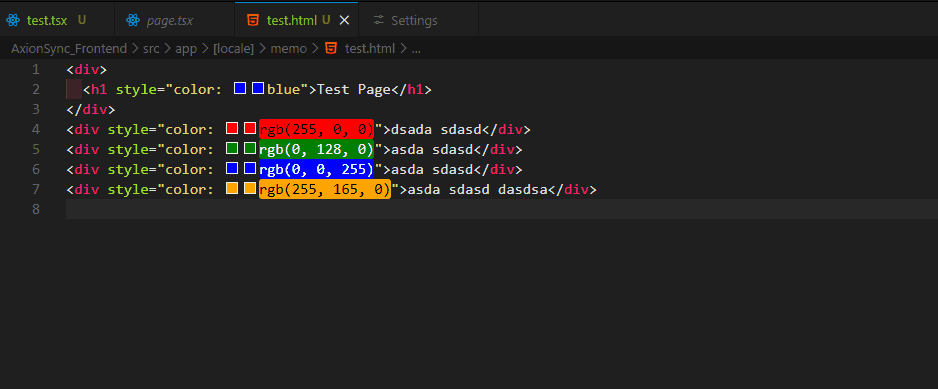
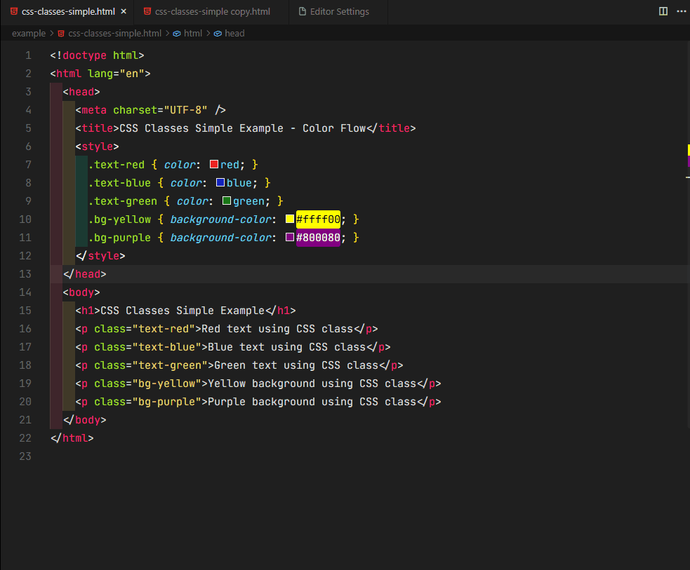
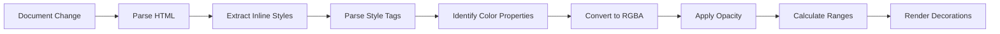

<div align="center">

# 🌊 Color Flow

**Visualize CSS colors in HTML documents with intelligent , configurable highlighting**

[](https://marketplace.visualstudio.com/items?itemName=DotJumpDot.color-flow)
[](https://marketplace.visualstudio.com/items?itemName=DotJumpDot.color-flow)
[](https://marketplace.visualstudio.com/items?itemName=DotJumpDot.color-flow)
[](LICENSE)
[](https://code.visualstudio.com/)
[](https://www.typescriptlang.org/)

[VS Marketplace](https://marketplace.visualstudio.com/items?itemName=DotJumpDot.color-flow) • [Changelog](CHANGELOG.md) • [API Docs](AGENTS.md) • [Report Issue](https://github.com/DotJumpDot/Color-Flow/issues)

</div>

---

## 📺 Demo - Inline Styles



> Watch how Color Flow automatically highlights inline CSS colors in real-time as you type

## 📺 Demo - CSS Classes



> See how Color Flow highlights colors from CSS classes and handles nested element color inheritance

---

## ✨ Features

Color Flow enhances your HTML development experience by automatically detecting and visualizing inline CSS colors with beautiful, configurable background highlights.

- 🎯 **Automatic Detection** - Instantly identifies inline CSS colors as you type
- 🎨 **Multiple Color Formats** - Supports named colors, hex, rgb/rgba, hsl/hsla
- 🏷️ **Class Highlighting** - Highlights colors defined in CSS classes within `<style>` tags and linked CSS files
- 🎭 **CSS Variables** - Parse and resolve CSS custom properties like `var(--my-color)` with fallback support
- 📂 **External CSS Files** - Reads and resolves CSS from linked `<link rel="stylesheet">` files
- ⚙️ **Flexible Highlighting** - Choose from full-line, word-only, or character-range modes
- 🎨 **Customizable Appearance** - Adjust opacity, borders, and border radius to match your style
- ⚡ **Real-time Updates** - See changes instantly as you edit your code
- 🔄 **Quick Toggle** - Enable/disable with a single command or status bar click
- 📊 **Status Bar Indicator** - Visual feedback showing current extension state
- 🌐 **Multi-language Support** - Works with HTML, PHP, Vue, Svelte, Astro, TSX, JSX, Razor, Handlebars, and EJS

---

## 📦 Extension Info

| Property           | Value                                                                                   |
| ------------------ | --------------------------------------------------------------------------------------- |
| **Name**           | Color Flow                                                                              |
| **Publisher**      | DotJumpDot                                                                              |
| **Extension ID**   | `DotJumpDot.color-flow`                                                                 |
| **Version**        | 1.5.1                                                                                   |
| **VS Marketplace** | [Color Flow](https://marketplace.visualstudio.com/items?itemName=DotJumpDot.color-flow) |

---

## 🚀 Installation

### Via VS Code Marketplace (Recommended)

1. Open VS Code
2. Press `Ctrl+Shift+X` (or `Cmd+Shift+X` on macOS) to open Extensions
3. Search for **"Color Flow"**
4. Click **Install**

### Via Command Palette

```bash
code --install-extension DotJumpDot.color-flow
```

### From VSIX File

1. Download the latest `.vsix` file from the [Releases](https://github.com/DotJumpDot/Color-Flow/releases) page
2. In VS Code, go to `Extensions` → `...` (three dots) → `Install from VSIX`
3. Select the downloaded file

---

## 📖 Usage

Once installed, Color Flow automatically highlights colors in documents with inline styles:

### Basic Example

```html
<div style="color: blue">
  <p style="color: red">This text will have a red background</p>
  <span style="background-color: green; color: white">Green background</span>
</div>
```

### Status Bar Control

Look for the Color Flow icon in the bottom-left status bar:

- **Enabled**: `$(symbol-color) Color Flow`
- **Disabled**: `$(symbol-color) Color Flow $(circle-slash)`

Click the status bar item to quickly access Color Flow settings.

### Keyboard Commands

| Command Palette Command           | Keyboard Shortcut | Description                        |
| --------------------------------- | ----------------- | ---------------------------------- |
| `Color Flow: Open Settings`       | -                 | Open extension settings page       |
| `Color Flow: Toggle Highlighting` | -                 | Toggle color highlighting on/off   |
| `Color Flow: Refresh Decorations` | -                 | Manually refresh color decorations |

---

## ⚙️ Configuration

Color Flow provides extensive configuration options to customize your highlighting experience.

### Quick Configuration

```json
{
  "colorFlow.enabled": true,
  "colorFlow.opacity": 0.2,
  "colorFlow.enableBorder": false,
  "colorFlow.borderColor": "currentColor",
  "colorFlow.borderRadius": "0px",
  "colorFlow.highlightMode": "char-range",
  "colorFlow.enableClassHighlighting": true
}
```

### Detailed Settings

#### `colorFlow.enabled`

Controls whether color highlighting is active globally.

- **Type:** `boolean`
- **Default:** `true`
- **Example:**

```json
{
  "colorFlow.enabled": false
}
```

#### `colorFlow.opacity`

Controls the transparency of background color highlights.

- **Type:** `number` (range: 0-1)
- **Default:** `0.2`
- **Example:**

```json
{
  "colorFlow.opacity": 0.5
}
```

#### `colorFlow.enableBorder`

Adds a border around highlighted text for better visibility.

- **Type:** `boolean`
- **Default:** `false`
- **Example:**

```json
{
  "colorFlow.enableBorder": true
}
```

#### `colorFlow.borderColor`

Sets the color of the border (when `enableBorder` is true).

- **Type:** `string`
- **Default:** `"currentColor"`
- **Supported formats:** Hex, RGB, HSL, or named colors
- **Example:**

```json
{
  "colorFlow.borderColor": "#000000"
}
```

#### `colorFlow.borderRadius`

Controls the roundness of border corners.

- **Type:** `string`
- **Default:** `"0px"`
- **Example:**

```json
{
  "colorFlow.borderRadius": "4px"
}
```

#### `colorFlow.highlightMode`

Determines how much of the text to highlight.

- **Type:** `enum`
- **Options:**
  - `full-line` - Highlights entire line(s) from start to end
  - `word-only` - Highlights individual words, skipping spaces between them
  - `char-range` - Highlights the exact element text range, trimming whitespace
- **Default:** `char-range`
- **Example:**

```json
{
  "colorFlow.highlightMode": "word-only"
}
```

#### `colorFlow.enableClassHighlighting`

Enables highlighting for colors defined in CSS classes within `<style>` tags and linked CSS files.

- **Type:** `boolean`
- **Default:** `true`
- **Example:**

```json
{
  "colorFlow.enableClassHighlighting": false
}
```

**Note:** This feature parses CSS rules from style blocks and external CSS files, then applies colors to elements that reference those classes via `class` attributes. It also resolves CSS custom properties (variables) like `var(--my-color)`.

---

## 🎨 Supported Color Formats

Color Flow intelligently recognizes and processes the following color formats:

| Format           | Examples                                                 |
| ---------------- | -------------------------------------------------------- |
| **Named Colors** | `red`, `blue`, `green`, `tomato`, `slateblue`            |
| **Hex Colors**   | `#f00`, `#ff0000`, `#ff0000ff`, `#FFF`                   |
| **RGB/RGBA**     | `rgb(255,0,0)`, `rgba(255,0,0,0.5)`, `rgb(100%, 0%, 0%)` |
| **HSL/HSLA**     | `hsl(0,100%,50%)`, `hsla(0,100%,50%,0.5)`                |

---

## 🌐 Supported Languages

Color Flow works seamlessly with the following file types and languages:

- 📄 **HTML** - Standard HTML files (`.html`, `.htm`)
- 🐘 **PHP** - PHP files with HTML content (`.php`)
- 💚 **Vue** - Vue Single File Components (`.vue`)
- 🔥 **Svelte** - Svelte components (`.svelte`)
- 🌟 **Astro** - Astro components (`.astro`)
- ⚛️ **TypeScript React** - TSX files (`.tsx`)
- ⚛️ **JavaScript React** - JSX files (`.jsx`)
- 🔵 **Razor** - Blazor files (`.razor`)
- 📝 **Handlebars** - Handlebars templates (`.hbs`)
- 🔧 **EJS** - Embedded JavaScript templates (`.ejs`)

---

## 🔍 How It Works

Color Flow uses a sophisticated parsing pipeline to deliver accurate and performant color visualization:



### Technical Details

1. **Document Parsing** - Uses `htmlparser2` for fast, accurate HTML parsing
2. **Style Extraction** - Identifies elements with inline `style` attributes
3. **CSS Parsing** - Extracts CSS rules from `<style>` tags and linked external CSS files
4. **CSS Variables** - Parses custom properties and resolves `var(--name)` references with fallback support
5. **Color Detection** - Extracts `color`, `background-color`, and `backgroundColor` properties
6. **Color Conversion** - Converts all formats to RGBA with configured opacity using `tinycolor2`
7. **Range Calculation** - Determines precise text ranges based on selected highlight mode
8. **Decoration Application** - Applies VS Code text decorations with real-time updates

---

## ⚠️ Limitations

Color Flow is designed for inline styles and class-based colors and currently supports:

✅ **Supported:**

- Inline styles (`style="..."` attributes)
- CSS class definitions (`.class { color: red; }`) within `<style>` tags and linked CSS files
- CSS custom properties (variables) like `var(--my-color)` with fallback support
- Direct color values (named, hex, rgb, hsl)
- Color inheritance from parent elements (nested elements inherit colors from ancestors)
- Real-time updates during editing

❌ **Not Supported:**

- Computed styles from JavaScript
- Dynamic color values from CSS expressions
- CSS variables defined in browser developer tools

---

## 🛠️ Development

### Prerequisites

- Node.js 18+
- Visual Studio Code 1.74.0+
- TypeScript 5.0+

### Setup

1. **Clone the repository**

```bash
git clone https://github.com/DotJumpDot/Color-Flow.git
cd Color-Flow
```

2. **Install dependencies**

```bash
npm install
```

3. **Compile TypeScript**

```bash
npm run compile
```

4. **Run tests**

```bash
npm test
```

5. **Launch in Debug Mode**

Open the project in VS Code and press `F5` to launch the extension in a new VS Code window with the extension loaded.

### Project Structure

```
color-flow/
├── src/
│   ├── colorConverter.ts      # Color parsing and conversion
│   ├── styleParser.ts          # CSS style string parsing
│   ├── htmlParser.ts           # HTML document parsing
│   ├── cssParser.ts            # CSS class color extraction
│   ├── settingsManager.ts      # Extension configuration
│   ├── decorationManager.ts    # VS Code decoration handling
│   └── extension.ts            # Main entry point
├── assets/                     # Images and demo files
├── test/                       # Test files
├── package.json                # Extension manifest
├── tsconfig.json              # TypeScript configuration
└── README.md                  # This file
```

### Build Commands

| Command           | Description                      |
| ----------------- | -------------------------------- |
| `npm run compile` | Compile TypeScript to JavaScript |
| `npm run watch`   | Watch for changes and compile    |
| `npm run pretest` | Compile before tests             |
| `npm test`        | Run test suite                   |
| `npm run lint`    | Run ESLint                       |
| `npm run package` | Package extension into .vsix     |

---

## 🤝 Contributing

Contributions are welcome and appreciated! Here's how you can help:

### Reporting Bugs

Before creating bug reports, please check existing issues to avoid duplicates. When reporting a bug, include:

- OS and VS Code version
- Extension version
- Steps to reproduce
- Expected vs actual behavior
- Screenshots if applicable

### Suggesting Features

Feature requests are welcome! Please describe:

- The use case
- Proposed implementation (if you have ideas)
- How it would benefit users

### Submitting Pull Requests

1. Fork the repository
2. Create a feature branch (`git checkout -b feature/amazing-feature`)
3. Commit your changes (`git commit -m 'Add amazing feature'`)
4. Push to the branch (`git push origin feature/amazing-feature`)
5. Open a Pull Request

Please ensure your code:

- Follows existing code style
- Includes tests for new functionality
- Updates documentation as needed
- Passes all linting checks

---

## 📊 Performance

Color Flow is optimized for minimal performance impact:

- ⚡ **Fast Parsing** - Uses `htmlparser2` for efficient HTML parsing
- 🎯 **Debounced Updates** - 100ms delay prevents excessive decorations during typing
- 💾 **Decoration Caching** - Reuses VS Code decoration types for better performance
- 🔍 **Selective Processing** - Only processes supported file types

---

## 🗺️ Roadmap

Future enhancements planned:

- [ ] Color picker integration
- [ ] Custom color themes
- [ ] Export color palette
- [ ] Support for computed styles
- [ ] Color contrast checker
- [ ] Additional highlight modes
- [ ] CSS @import support (importing external CSS from within CSS files)

---

## 📜 License

This project is licensed under the MIT License - see the [LICENSE](LICENSE) file for details.

```
MIT License

Copyright (c) 2026 DotJumpDot

Permission is hereby granted, free of charge, to any person obtaining a copy
of this software and associated documentation files (the "Software"), to deal
in the Software without restriction, including without limitation the rights
to use, copy, modify, merge, publish, distribute, sublicense, and/or sell
copies of the Software, and to permit persons to whom the Software is
furnished to do so, subject to the following conditions:

The above copyright notice and this permission notice shall be included in all
copies or substantial portions of the Software.
```

---

## 🙏 Credits

Built with amazing open-source libraries:

- [htmlparser2](https://github.com/fb55/htmlparser2) - Fast and forgiving HTML/XML parser
- [tinycolor2](https://github.com/bgrins/TinyColor) - Color manipulation and conversion library
- [vscode](https://code.visualstudio.com/) - Visual Studio Code Extension API

---

## 📚 Resources

| Resource              | Link                                                                                    |
| --------------------- | --------------------------------------------------------------------------------------- |
| **VS Marketplace**    | [Color Flow](https://marketplace.visualstudio.com/items?itemName=DotJumpDot.color-flow) |
| **GitHub Issues**     | [Report Issues](https://github.com/DotJumpDot/Color-Flow/issues)                        |
| **API Documentation** | [AGENTS.md](AGENTS.md)                                                                  |
| **Changelog**         | [CHANGELOG.md](CHANGELOG.md)                                                            |
| **Releases**          | [GitHub Releases](https://github.com/DotJumpDot/Color-Flow/releases)                    |

---

## 💬 Support

- 📖 **Documentation**: Check out our [API documentation](AGENTS.md)
- 🐛 **Bug Reports**: Open an issue on [GitHub](https://github.com/DotJumpDot/Color-Flow/issues)
- 💡 **Feature Requests**: Share your ideas in our [discussions](https://github.com/DotJumpDot/Color-Flow/discussions)
- ⭐ **Star Us**: If you find Color Flow useful, give us a star on [GitHub](https://github.com/DotJumpDot/Color-Flow)!

---

<div align="center">

**Made with ❤️ by [DotJumpDot](https://github.com/DotJumpDot)**

[⬆ Back to top](#-color-flow)

</div>
